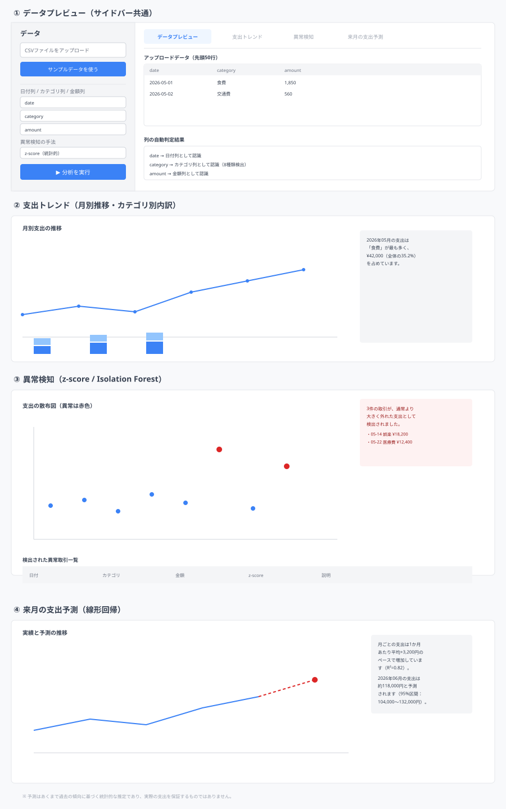
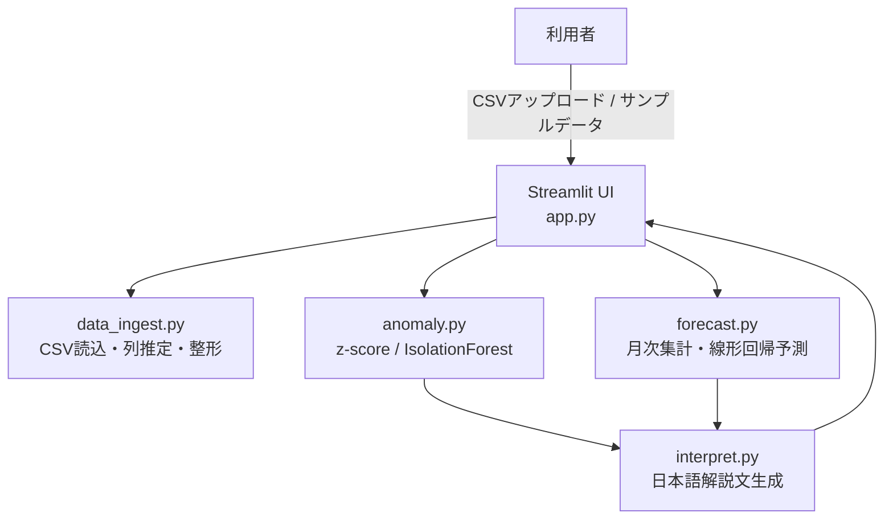

# PySense - 支出異常検知・予測付き家計簿アプリ

家計簿の取引データ（CSV）から、支出の傾向・異常な取引・来月の支出予測を可視化するPython製Webアプリです。Streamlit + pandas + scikit-learnで実装しています。

## 主な機能

- **CSV取込・列自動判定**: 日付・カテゴリ・金額の列名を自動推定（日本語列名にも対応）。Shift-JIS/UTF-8のどちらでも読み込み可能。
- **支出トレンド**: 月別の支出合計推移、カテゴリ別の積み上げグラフ。
- **異常検知**: z-score法（統計的・説明しやすい）とIsolation Forest（機械学習）の2手法を切り替え可能。通常より大きく外れた取引を検出し、平易な日本語で解説。
- **来月の支出予測**: 月次支出の推移を線形回帰で分析し、来月の支出合計を95%予測区間つきで提示。
- **サンプルデータ生成**: 実データがなくても動作確認できるよう、8カテゴリ・約180日分のサンプル取引データ（異常値6件混入）を生成。

## UIイメージ



サイドバーでCSVをアップロード（またはサンプルデータを使用）し、日付・カテゴリ・金額の列と異常検知の手法を選択します。右側のタブ（データプレビュー／支出トレンド／異常検知／来月の支出予測）で、グラフと解説文を確認できます。

## 技術スタック

| 分類 | 技術 |
| --- | --- |
| 言語 | Python 3.10+ |
| UIフレームワーク | Streamlit |
| データ処理 | pandas, numpy |
| 機械学習 | scikit-learn（IsolationForest, LinearRegression） |
| 可視化 | Plotly |
| テスト | pytest |

## システム構成



## ディレクトリ構成

```
pysense/
├── app.py                    # Streamlit UI
├── core/
│   ├── data_ingest.py         # CSV読込・列自動判定・バリデーション
│   ├── anomaly.py             # 異常検知（z-score / Isolation Forest）
│   ├── forecast.py            # 月次集計・線形回帰による支出予測
│   ├── interpret.py           # 平易な日本語解説文の生成
│   └── sample_data.py         # サンプル取引データ生成
├── tests/                     # pytestテスト（23件）
├── requirements.txt
├── pytest.ini
└── ui-wireframe.svg
```

## セットアップ

1. Python 3.10以上をインストール
2. 依存パッケージをインストール
   ```
   pip install -r requirements.txt
   ```
3. テストを実行（任意）
   ```
   pytest
   ```
4. アプリを起動
   ```
   streamlit run app.py
   ```
5. ブラウザで `http://localhost:8501` を開き、サイドバーから「サンプルデータを使う」→「分析を実行」を押すと動作を確認できます。

## 今後の展望

- 複数月にまたがる予算設定・アラート機能の追加
- カテゴリ別の異常検知（現状は全体一律の手法だが、カテゴリごとに最適な手法を自動選択）
- 外部家計簿サービス（Money Forward等）とのAPI連携によるリアルタイム取込
- 異常検知結果に対するユーザーフィードバック（「これは正常な支出でした」等）を学習に反映するアクティブラーニング

## 開発環境についての補足

このアプリはサンドボックス環境内でPythonを実際にインストール・実行し、pytest（23件全通過）とStreamlitのヘッドレス起動確認まで行った上で作成しています。R言語で作成した過去のアプリ群（PortfoliR等）とは異なり、Pythonはサンドボックス内で完全に動作検証できるため、ロジックのバグはこの段階でほぼ解消済みです。ただし、ブラウザ上での実際の見た目・操作感については、お手元の環境で `streamlit run app.py` を実行してご確認ください。
