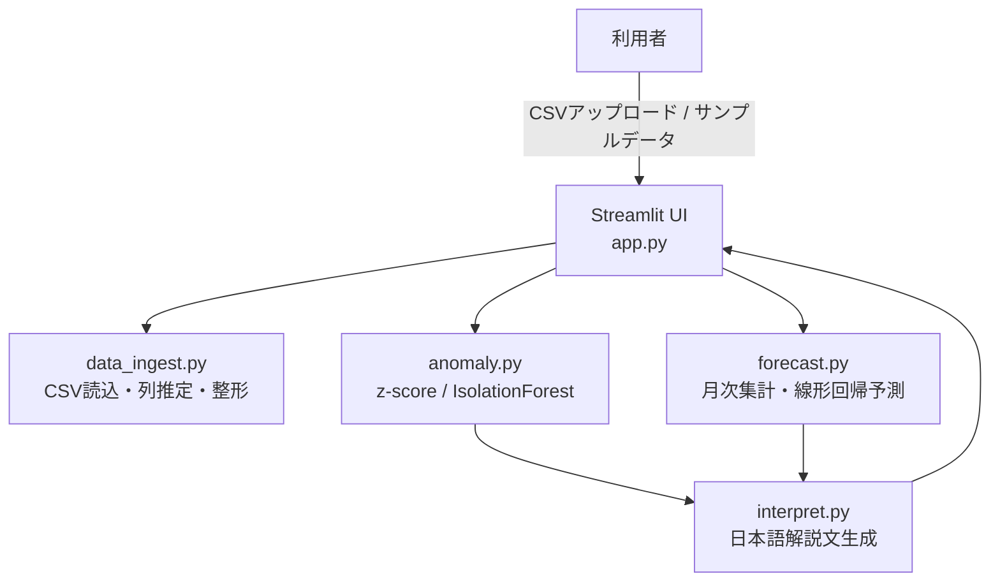
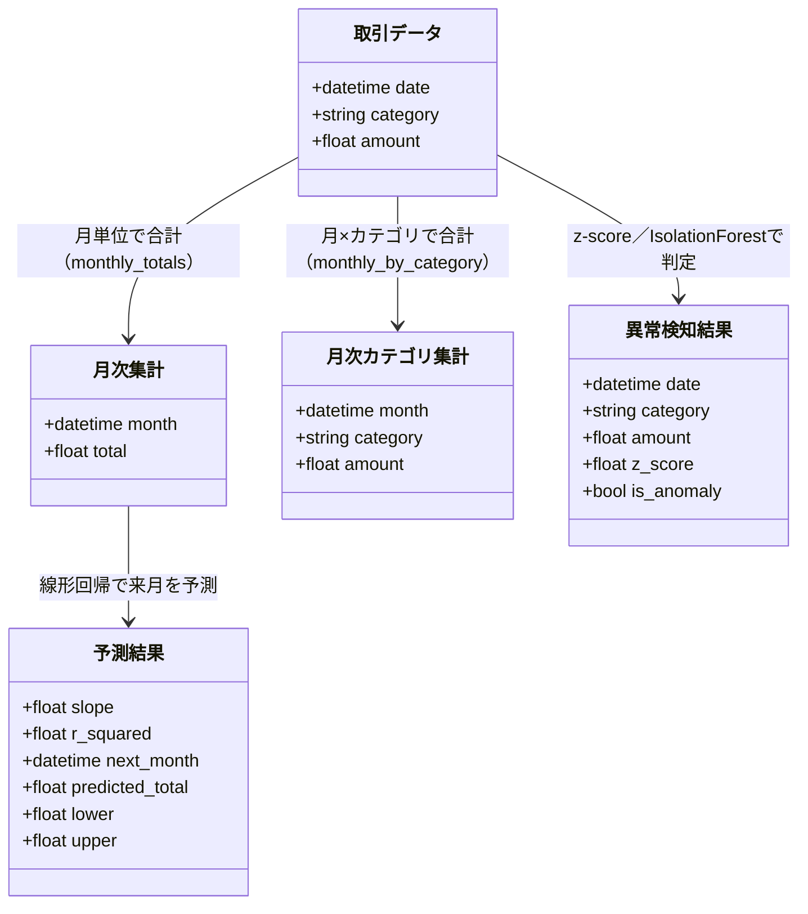

# PySense（パイセンス）


家計簿の取引データを「見える化」し、異常な支出と来月の見通しに気づけるようにするWebアプリ

## 目次

- [概要](#概要)
- [特徴（主な機能）](#特徴主な機能)
- [想定ユーザー（ペルソナ）](#想定ユーザーペルソナ)
- [UIイメージ](#uiイメージ)
- [技術スタック](#技術スタック)
- [システム構成図](#システム構成図)
- [データ構造](#データ構造)
- [セットアップ](#セットアップ)
- [今後の展望](#今後の展望)

## 概要

クレジットカードや家計簿アプリの明細CSVは、月末にまとめて眺めるだけになりがちで、「今月は先月よりどのくらい使ったか」「この支出は普段と比べて多いのか」を、その場で客観的に把握するのは意外と難しいという課題があります。

PySense は、取引履歴のCSVを読み込むだけで、月別の支出推移・カテゴリ別の内訳・通常より大きく外れた支出（異常検知）・来月の支出見込みを自動で分析し、平易な日本語の解説文つきで提示するダッシュボード型Webアプリです。統計的な手法（z-score）と機械学習（Isolation Forest, 線形回帰）の両方を実装し、目的に応じて切り替えられるようにしています。

## 特徴（主な機能）

| # | 機能 | 内容 |
| --- | --- | --- |
| 1 | CSV取込・列自動判定 | アップロードしたCSVの日付・カテゴリ・金額列を自動推定。日本語の列名やShift-JISエンコーディングにも対応 |
| 2 | サンプルデータ生成 | ボタン1つで8カテゴリ・約180日分のダミー取引データ（異常値6件を意図的に混入）を生成し、実データがなくても試せる |
| 3 | 支出トレンド可視化 | 月別支出推移の折れ線グラフ、カテゴリ別内訳の積み上げ棒グラフ、直近月の最多カテゴリを説明する解説文 |
| 4 | 異常検知（統計 / 機械学習を切替） | z-score法（カテゴリ内の平均からの乖離）とIsolation Forest（機械学習）の2手法を切り替え可能。検出結果は一覧表と散布図で確認できる |
| 5 | 来月の支出予測 | 月次支出の推移を線形回帰で分析し、来月の支出合計を95%予測区間つきで提示 |
| 6 | 平易な日本語の解説文 | 統計量をそのまま出すのではなく、「1か月あたり平均◯円のペースで増加しています」のような文章で結果を説明 |

## 想定ユーザー（ペルソナ）

**ペルソナ①：山田愛子（26歳・一人暮らしの会社員）**
- クレジットカードの明細は月末にまとめて見るだけで、途中で使いすぎに気づけない
- 後から見返したときに「これは普段より高い、異常な支出だったのか」を客観的な数字で知りたい
- 家計簿アプリは入力が続かないので、CSVを読み込むだけで自動的に教えてくれるツールが欲しい

**ペルソナ②：中村大輔（34歳・共働き世帯の夫）**
- 毎月の支出額が変動しやすく、来月いくらかかりそうか見通しが立てにくい
- カード会社からエクスポートしたCSVはあるが、毎回Excelで集計し直すのが手間
- 過去の傾向から「このペースだと来月はいくらになりそうか」を数値で把握し、夫婦の家計会議の材料にしたい

## UIイメージ


実際の画面（Streamlitのデフォルトテーマ）に合わせたワイヤーフレームです。左サイドバーでCSVをアップロード（またはサンプルデータを使用）し、日付・カテゴリ・金額の列と異常検知の手法を選択して「分析を実行」を押すと、上部の4つのタブで結果を確認できます。

- **データプレビュー**：アップロードした取引データの先頭50行を表形式で確認
- **支出トレンド**：月別支出の折れ線グラフと、カテゴリ別内訳の積み上げ棒グラフ
- **異常検知**：検出結果の解説文（青色の情報ボックス）、異常取引の一覧表（`is_anomaly`列はチェックボックスで表示）、日付×金額の散布図（異常は赤色）
- **来月の支出予測**：予測結果の解説文と、実績・予測を重ねた折れ線グラフ

## 技術スタック

| 分類 | 技術 | 選定理由 |
| --- | --- | --- |
| 言語 | Python 3.10+ | データ分析・機械学習のエコシステムが豊富で、統計処理と可視化を1つの言語で完結できる |
| UIフレームワーク | Streamlit | Pythonのコードだけで対話的なWebダッシュボードを短時間で構築できる |
| データ処理 | pandas, numpy | CSVの読み込み・集計・時系列処理の標準的な組み合わせ |
| 機械学習 | scikit-learn（IsolationForest, LinearRegression） | 異常検知と回帰予測を、実績のあるライブラリで安定して実装できる |
| 可視化 | Plotly | インタラクティブなグラフ（ズーム・ホバー）をStreamlitに簡単に組み込める |
| テスト | pytest | コアロジック（列判定・異常検知・予測・解説文生成）を関数単位で検証 |
| CI/CD | GitHub Actions | pushのたびに`pytest`を自動実行し、テストが通ることを継続的に検証 |

## システム構成図



CSVの取込・列推定を行う `data_ingest.py`、異常検知を行う `anomaly.py`、月次集計と予測を行う `forecast.py` が、それぞれの分析結果を `interpret.py` に渡して日本語の解説文に変換し、`app.py`（Streamlit UI）がそれらをグラフとともに表示します。

## データ構造

PySenseはPostgreSQLのような永続的なデータベースを持たず、アップロードされたCSVをpandasのDataFrameとしてメモリ上で処理します。そのため、PayMiru等で採用しているような正規化されたER図はありませんが、代わりに各分析結果がどのようなデータ構造として導出されるかを以下にまとめます。



| データ構造 | 主な列 / フィールド | 生成元 |
| --- | --- | --- |
| 取引データ | date, category, amount | `validate_and_prepare()`（CSVの列を正規化） |
| 月次集計 | month, total | `monthly_totals()` |
| 月次カテゴリ集計 | month, category, amount | `monthly_by_category()` |
| 異常検知結果 | date, category, amount, z_score / anomaly_score, is_anomaly | `detect_anomalies_zscore()` / `detect_anomalies_isolation_forest()` |
| 予測結果 | slope, r_squared, next_month, predicted_total, lower, upper | `forecast_next_month()` |

## セットアップ

1. Python 3.10以上をインストール
2. 依存パッケージをインストール
   ```
   pip install -r requirements.txt
   ```
3. テストを実行（任意）
   ```
   pytest
   ```
4. アプリを起動
   ```
   streamlit run app.py
   ```
5. ブラウザで `http://localhost:8501` を開き、サイドバーから「サンプルデータを使う」→「分析を実行」を押すと動作を確認できます。

## 今後の展望

「CSV取込・列自動判定」「支出トレンド可視化」「異常検知（統計/機械学習の切替）」「来月の支出予測」までを実装済みとし、以下は今後の拡張として位置づけます。

- 複数月にまたがる予算設定・予算超過アラート機能の追加
- カテゴリごとに最適な異常検知手法を自動選択する仕組み
- 外部家計簿サービス（Money Forward等）とのAPI連携によるリアルタイム取込
- 異常検知結果に対するユーザーフィードバック（「これは正常な支出でした」等）を学習に反映するアクティブラーニング
- 複数ユーザーでの支出比較・世帯単位での共有機能

開発メモ：本アプリは継続的に機能を追加予定です。ロジックはPythonの実行環境で動作検証（pytest全件通過）まで行っていますが、ブラウザ上での見た目や操作感は都度お手元の環境でご確認ください。
